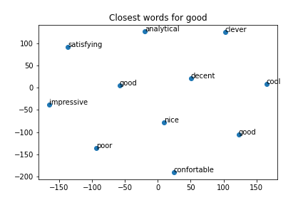
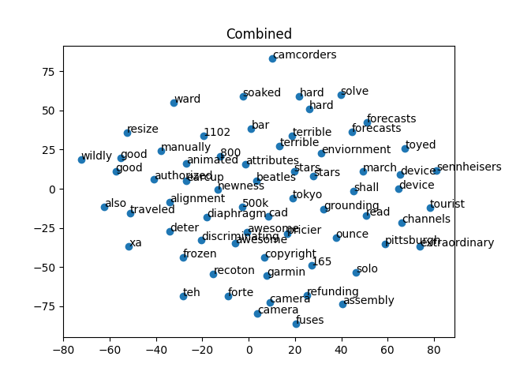

# Word2Vec
## 1. Co-Occurrence Matrix using Singular Value Decomposition

Parameters:
- window_size: 3
- Dataset: 50,000 words from review text in json
- Embedding size: k=100

### i) Display the top-10 word vectors for 5 different words (a combination of nouns, verbs, adjectives etc) using the above pre-trained models (1,2) using t-SNE (or such methods).


- Words selected:
1. `good`
```json
[cosine similarity with good, word]
[
    [1.0, 'good'],
    [0.5770181136622661, 'poor'],
    [0.5590366364996886, 'decent'],
    [0.5358629696295616, 'nice'],
    [0.4903202257442127, 'analytical'],
    [0.46002077467624664, 'confortable'],
    [0.4590125799348875, 'cool'],
    [0.45778837171129955, 'satisfying'],
    [0.4573877951482286, 'clever'],
    [0.4489832165227586, 'impressive']
]
```


2. `device`
```json
[
    [0.9999999999999996, 'device'],
    [0.7146844167645502, 'mouse'],
    [0.6182899589989177, 'unit'],
    [0.6075032342906476, 'turntable'],
    [0.6032389308804491, 'item'],
    [0.5862639298548418, 'keyboard'],
    [0.5706617421837645, 'trackball'],
    [0.5671190083860997, 'product'],
    [0.5080085495666492, 'hub'],
    [0.5055529767997313, 'coupler']
]
```


3. `terrible`
```json
[
    [1.0000000000000002, 'terrible'],
    [0.8409054729602425, 'horrible'],
    [0.6580112627481659, 'aweful'],
    [0.6234395908627309, 'atrocious'],
    [0.6099042106877444, 'lacking'],
    [0.605298145473402, 'unsuccessful'],
    [0.5913805596774726, 'unreadable'],
    [0.5844990604525979, 'flakey'],
    [0.5841090011454736, 'incorrect'],
    [0.5838996261163525, 'delivered']
]
```


4. `hard`
```json
[
    [1.0000000000000002, 'hard'], 
    [0.7623197497709451, 'harder'], 
    [0.7552332397762881, 'difficult'], 
    [0.7375796560862065, 'tough'], 
    [0.7326588318838225, 'impossible'], 
    [0.6750210547972565, 'due'], 
    [0.6289878133400717, 'prior'], 
    [0.6260663816830923, 'tends'], 
    [0.6254360175627666, 'inability'], 
    [0.6202837672840079, 'tend']
]
```


5. `awesome`
```json
[
    [1.0000000000000002, 'awesome'], 
    [0.9698667329436526, 'amazing'], 
    [0.9569872778115437, 'incredible'], 
    [0.9010620172791558, 'outstanding'], 
    [0.8853923002042673, 'excellent'], 
    [0.8622324013014016, 'exceptional'], 
    [0.8138512755727286, 'absolute'], 
    [0.8009949151666931, 'astonishing'], 
    [0.7944746055891083, 'insane'], 
    [0.7852796069344451, 'unbelievable']
]
```


### ii) What are the top 10 closest words for the word ‘camera’ in the embeddings generated by your program. Compare them against the pre-trained word2vec embeddings that you can download off the shelf (can use gensim).
- my output for `camera`
```json
[cosine similarity with camera, word]
[
    [1.0000000000000002, 'camera'],
    [0.878697425488289, 'western'],
    [0.828658397016433, '5696'],
    [0.8149472178511531, 'editions'],
    [0.8136504992130851, 'cameras'],
    [0.8106266698581683, 'dolby'],
    [0.7786383938566943, 'dts'],
    [0.7514952963851032, 'slrs'],
    [0.7331779031336059, 'darkroom'],
    [0.7241787402334683, 'revolution']
]
```


- gensim output for `camera`
```json
[
    'rebel',
    'camcorder',
    'cameras',
    'slr',
    'dslr',
    'scope',
    'cam',
    'lens',
    '20d',
    'tripod'
]
```

Comparison:     
- Some of the words are same, some are similar.
- The model is pretty good at predicting similar words given we ran it on only 50k lines.
- Some of the output in my model are not in gensim model but they do make sense.


## CBOW Model

Parameters:
- `batch_size` = 64
- `eta` = 0.035 # rate of change (η)
- `N` = 100     # (dimensions of vectors)
- `iterations` = 150000
- `window` = 2
- `V` = len(word2ind)  # 20k approx.

The model took nearly 4 hours to train. After which I stopped it.   
For safety the code uploaded the embeddings periodically after every `iterations%1000==0` to GDrive.    
Link to which are given in README.

The results of Co-occurence matrix were better than the results of this model.

### i) Display the top-10 word vectors for 5 different words (a combination of nouns, verbs, adjectives etc) using the above pre-trained models (1,2) using t-SNE (or such methods).

- `awesome`
```json
[
    [1.0000000000000002, 'awesome'], 
    [0.8610310384476787, 'copyright'], 
    [0.8570153427928442, 'discriminating'], 
    [0.8547263344567517, 'cad'], 
    [0.8524179588259821, '500k'], 
    [0.8499955631753182, 'pricier'], 
    [0.849619367830584, 'solo'], 
    [0.8489739378181572, 'diaphragm'], 
    [0.848635903629313, 'tokyo'], 
    [0.8476495468851546, 'deter']
]
```


- `terrible`
```json
[
    [0.9999999999999999, 'terrible'], 
    [0.8533832726871386, 'stars'], 
    [0.8427705353391599, 'channels'], 
    [0.8386304232571486, '1102'], 
    [0.8364704334724535, 'forecasts'], 
    [0.8353417549292382, 'enviornment'], 
    [0.8346029179980716, 'grounding'], 
    [0.8341942647479945, 'pittsburgh'], 
    [0.8331818431177949, 'bar'], 
    [0.8325427871636351, 'ounce']
]
```


- `device`
```json
[
    [0.9999999999999999, 'device'], 
    [0.841755775826985, 'soaked'], 
    [0.8371412262605156, 'extraordinary'], 
    [0.8338629581263695, 'march'], 
    [0.8315043279844431, 'shall'], 
    [0.8308604804434752, 'toyed'], 
    [0.8290988529246754, 'tourist'], 
    [0.8288787980758728, 'sennheisers'], 
    [0.8275826743562401, 'read'], 
    [0.8275714597344346, 'beatles']
]
```


- `good`
```json
[
    [0.9999999999999998, 'good'], 
    [0.8458976005103374, 'alignment'], 
    [0.8445296511932058, 'manually'], 
    [0.8404695500885472, 'newness'], 
    [0.8368359427720032, 'wildly'], 
    [0.836583352855809, 'resize'], 
    [0.8346112105708782, 'earcup'], 
    [0.8344272568058594, 'traveled'], 
    [0.8332659192201021, 'animated'], 
    [0.8308476869158881, 'authorized']
]
```


- `hard`
```json
[
    [0.9999999999999998, 'hard'], 
    [0.8375697345916577, 'solve'], 
    [0.8341558536474667, 'also'], 
    [0.8332960977270142, 'attributes'], 
    [0.8330539000529622, '800'], 
    [0.832613716509912, 'recoton'], 
    [0.8322193095494975, 'frozen'], 
    [0.831718696110355, 'forecasts'], 
    [0.8308575786088273, 'xa'], 
    [0.8302855402096363, 'stars']
]
```


### ii) What are the top 10 closest words for the word ‘camera’ in the embeddings generated by your program. Compare them against the pre-trained word2vec embeddings that you can download off the shelf (can use gensim).

- `camera`
```json
[
    [0.9999999999999998, 'camera'], 
    [0.8488535748120859, 'ward'], 
    [0.8442719871944019, 'forte'], 
    [0.8381578433056814, 'camcorders'], 
    [0.8379014563108926, 'garmin'], 
    [0.8377802257203305, 'assembly'], 
    [0.8371899179691332, 'fuses'], 
    [0.8361124581629774, 'teh'], 
    [0.8358623910364454, '165'], 
    [0.8356080251738163, 'refunding']
]
```


- All words combined



Comparison:
- The model is not as good as Gensim.
- The dataset is quite small (50k lines).
- Some words are quite good while some don't have any relation.
- Increasing the dataset and training it for more time will surely make this model more precise.